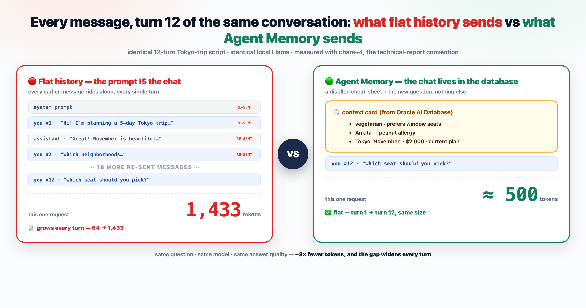
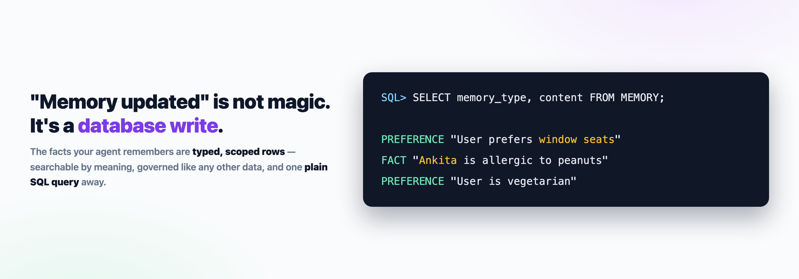

# The Memory Illusion — AI Agent Memory, Live on Your Laptop

Your AI chat app feels like it remembers you. It doesn't. This repo proves it —
and then fixes it — with two runnable demos and a set of interactive
explainer decks. Everything runs **100% local**: a free Oracle AI Database in
Docker, Llama via Ollama. No cloud. No API keys.

> 📺 Companion video: coming soon on [@RahulWagh](https://www.youtube.com/@RahulWagh)



## The experiment

One scripted 12-turn conversation (planning a Tokyo trip), run twice:

| | Demo 1 — flat history | Demo 2 — Oracle Agent Memory |
|---|---|---|
| Conversation state | re-sent inside every prompt | rows in **Oracle AI Database** |
| Tokens per request | 64 → **1,433** (climbing) | ≈ **500** (flat) |
| Turn-12 recall ("which seat?") | works — by re-reading everything | works — by **remembering** |

Measured on a real run (both demos print this per turn — the chart is
generated by `plot_comparison.py` from the actual logs):


The memory layer is the official
[`oracleagentmemory`](https://pypi.org/project/oracleagentmemory/) package,
doing three jobs: **store** the chat (`add_messages`) · **distill** the facts
(a plain-English extraction policy) · **find** them (`get_context_card`).

And the part nobody sees in their chat apps — the *"Memory updated"* toast —
is just this:



---

# Installation

Everything below takes a fresh machine to a working demo in ~15 minutes
(mostly download time). Each step ends with a **Verify** check — don't move
on until it passes.

## 0. Prerequisites

| Tool | Version | Verify with |
|---|---|---|
| Docker (Desktop or Engine) | 20.10+ | `docker --version` |
| Python | **3.11+ (3.12 recommended)** | `python3.12 --version` |
| Git | any recent | `git --version` |
| Free disk | ~12 GB | Oracle image ~9 GB + Llama ~5 GB |

> ⚠️ **Python 3.10 will not work** — a dependency (`litellm`) needs 3.11+.
> On macOS: `brew install python@3.12`, then use `python3.12` below.

macOS: make sure Docker Desktop is **running** before any `docker` command.

## 1. Get the code

```bash
git clone https://github.com/rahulwagh/oracle-agent-memory-demo.git
cd oracle-agent-memory-demo
```

## 2. The database — where the memories will live

Create the Oracle AI Database Free container (first time only; ~3.5 GB
download — note: Oracle brands it *26ai*, but the container tag is `23.26.x`):

```bash
docker run -d --name oracle26ai \
  -p 1521:1521 \
  -e ORACLE_PWD=Welcome_123 \
  -v oracle26ai-data:/opt/oracle/oradata \
  container-registry.oracle.com/database/free:23.26.1.0
```

Then bootstrap and verify it with [`setup_db.sh`](setup_db.sh) (in the repo
root) — it starts the container if stopped, waits until the listener
**really** accepts connections, and creates the `memdemo` user the demos
connect as. Idempotent — safe to re-run any time:

```bash
bash setup_db.sh
```

**Verify:**
```
  ✓ database is up
  ✓ memdemo/Welcome_123 ready on oracle26ai (localhost:1521/FREEPDB1)
```

> A fresh container's first boot takes several minutes (it builds the seed
> database) — the script polls with a real query, just let it wait.

## 3. The models — the brain and the embedder

The demos talk to two small local models through [Ollama](https://ollama.com):
`llama3.1:8b` answers questions **and** distills memories; `nomic-embed-text`
turns text into vectors so memories can be found by meaning.

```bash
brew install ollama                 # macOS (or: ollama.com/download)
brew services start ollama          # daemon on :11434

ollama pull llama3.1:8b             # ~5 GB
ollama pull nomic-embed-text        # ~270 MB
```

**Verify:**
```bash
curl -s http://127.0.0.1:11434/api/tags | grep -o '"name":"[^"]*"'
# expect both: llama3.1:8b and nomic-embed-text
```

## 4. The Python environment

```bash
cd agent-memory-use-case/live-demo
python3.12 -m venv .venv
source .venv/bin/activate

python -m pip install --upgrade pip
pip install oracleagentmemory rich matplotlib requests
```

**Verify:**
```bash
python -c "import litellm, oracleagentmemory, oracledb; import sys; print('imports OK —', sys.version.split()[0])"
# imports OK — 3.12.x
```

> Every `python` command below assumes the venv is **active**
> (`source .venv/bin/activate` in each new shell). Running the system
> `python3` instead is the #1 cause of `No module named 'litellm'`.

## 5. End-to-end check

One line proves the venv can reach the database:

```bash
python -c "
import oracledb
c = oracledb.connect(user='memdemo', password='Welcome_123', dsn='localhost:1521/FREEPDB1')
print('connected:', c.version); c.close()"
# connected: 23.26.x.x
```

And warm the model so the first demo call isn't ~30 s slow:

```bash
curl -s http://127.0.0.1:11434/api/generate -d '{"model":"llama3.1:8b","prompt":"warm","stream":false}' > /dev/null
```

## 6. Run the demos

```bash
python demo1_flat_history.py     # 🔴 the problem — tokens climb 64 → 1,433
python demo2_agent_memory.py     # 🟢 the fix — stays ≈500, prints the memories
python show_memories.py          # 🔍 "Memory updated" = SELECT-able rows
python plot_comparison.py        # 📉 your own token chart
```

What success looks like (demo-2 numbers vary a few tokens per run —
extraction is LLM-driven):

| | turn 1 | turn 12 | whole run |
|---|---|---|---|
| demo 1 · flat history | 64 tk | **1,433 tk** | ~9,000 tk |
| demo 2 · agent memory | ~240 tk | **≈ 500 tk** | ~6,000 tk |

---

# Using Oracle Agent Memory in your own app

**No extra installation, no extra service.** If you already have an Oracle AI
Database running (the container from step 2 is enough), Oracle Agent Memory
is *just a Python package* — the database is the memory infrastructure:

```bash
pip install oracleagentmemory
```

Wire it up with three things you already have — a DB connection, an embedder,
and an LLM — and start calling it:

```python
import oracledb
from oracleagentmemory.core import OracleAgentMemory, SchemaPolicy
from oracleagentmemory.core.llms.llm import Llm
from oracleagentmemory.core.embedders.embedder import Embedder
from oracleagentmemory.apis import Message

pool = oracledb.create_pool(user="memdemo", password="Welcome_123",
                            dsn="localhost:1521/FREEPDB1", min=1, max=4)

memory = OracleAgentMemory(
    connection=pool,
    embedder=Embedder(model="ollama/nomic-embed-text",
                      api_base="http://127.0.0.1:11434", embedding_dimension=768),
    llm=Llm(model="ollama/llama3.1:8b", api_base="http://127.0.0.1:11434"),
    schema_policy=SchemaPolicy.CREATE_IF_NECESSARY,   # creates its own tables
)

thread = memory.create_thread(thread_id="t1", user_id="user_1", agent_id="my_bot")

thread.add_messages([Message(role="user", content="I always prefer window seats.")])  # STORE
card = thread.get_context_card()          # FIND — compact, prompt-ready context
hits = thread.search("seating preferences")  # or query memories directly
```

That's the whole integration surface: `add_messages` as the conversation
flows, `get_context_card()` before each model call, `search()` when you need
targeted recall. The package manages its own schema
(`CREATE_IF_NECESSARY`), extraction runs on the LLM you give it, and every
row is scoped by `user_id` / `agent_id` / `thread_id`. For the full working
example — including a custom extraction policy — read
[`demo2_agent_memory.py`](agent-memory-use-case/live-demo/demo2_agent_memory.py)
or the [visual walkthrough](docs/demo2-visual-walkthrough.md).

---

## Troubleshooting

<details>
<summary><b><code>No module named 'litellm'</code></b></summary>

You ran the system `python3` instead of the venv — `source .venv/bin/activate`
first (or call `./.venv/bin/python …`). If it happens *inside* the venv, the
venv was created with Python ≤ 3.10 — recreate it with `python3.12 -m venv .venv`.
</details>

<details>
<summary><b><code>setup_db.sh</code> waits forever</b></summary>

First boot of a fresh container takes 5+ minutes. Watch
`docker logs -f oracle26ai` until `DATABASE IS READY TO USE!`, then re-run
`bash setup_db.sh`.
</details>

<details>
<summary><b><code>ORA-51962: vector memory area is out of space</code></b></summary>

The Free image ships with `vector_memory_size = 0`; give it a pool and restart:

```bash
docker exec -i oracle26ai sqlplus -S -L sys/Welcome_123@localhost:1521/FREE as sysdba <<'SQL'
ALTER SYSTEM SET vector_memory_size = 512M SCOPE=SPFILE;
EXIT;
SQL
docker restart oracle26ai && bash setup_db.sh
```
</details>

<details>
<summary><b>Warning about a missing purge job (CREATE JOB)</b></summary>

Benign for the demo. `setup_db.sh` grants the privilege — re-run it once if
you created the user another way.
</details>

<details>
<summary><b>First demo-2 turn is very slow</b></summary>

Ollama loading the model into memory — do the warm-up curl in step 5, or let
the first call take its ~30 s once.
</details>

<details>
<summary><b>Demo 2 fumbles a fact (e.g., the allergy)</b></summary>

Known limitation: extraction quality depends on the extractor LLM, and an 8B
model is the floor. One env var upgrades it:
`CHAT_MODEL=ollama/qwen2.5:14b python demo2_agent_memory.py`.
The memory *lifecycle* is a database problem — memory *quality* is still an
LLM problem.
</details>

<details>
<summary><b>Clean up / start over</b></summary>

```bash
docker stop oracle26ai              # pause the DB (data persists in the volume)
docker start oracle26ai             # bring it back
docker rm -f oracle26ai && docker volume rm oracle26ai-data   # remove everything
```

Demo 2 wipes and recreates its own thread + memories on every run — takes are
reproducible with no manual cleanup.
</details>

---

## Understand the code

- [**Visual walkthrough**](docs/demo2-visual-walkthrough.md) — the whole of
  `demo2_agent_memory.py` in 7 pictures, zero jargon
- [**Line-by-line breakdown**](docs/demo2-agent-memory-breakdown.md) — every
  block, the extraction policy, sequence diagram, and the exact math of why
  tokens stay flat

## The explainer decks

Self-contained HTML slides (open in a browser, arrow keys to step) in
[`agent-memory-use-case/demo/`](agent-memory-use-case/demo/):

- `memory-illusion-demo.html` — the concept: 5 facts your chat app never shows you
- `demo1-step-by-step.html` — flat history, with a live payload X-ray
- `demo2-step-by-step.html` — the memory layer: store · distill · find
- `code-walkthrough-step-by-step.html` — the whole thing in three calls
- `agent-memory-step-by-step.html` — combined architecture overview

## Reference

- Oracle Developers Blog: [Agent memory is a database problem](https://blogs.oracle.com/developers/agent-memory-is-a-database-problem-oracle-research-makes-the-case)
- Technical report: *Oracle Agent Memory as an Enterprise Memory Substrate for
  Long-Horizon AI Agents* (arXiv:2607.13157)

## License

Copyright (c) 2026 Rahul Wagh. Licensed under the Universal Permissive License
v1.0 — see [LICENSE](LICENSE).
