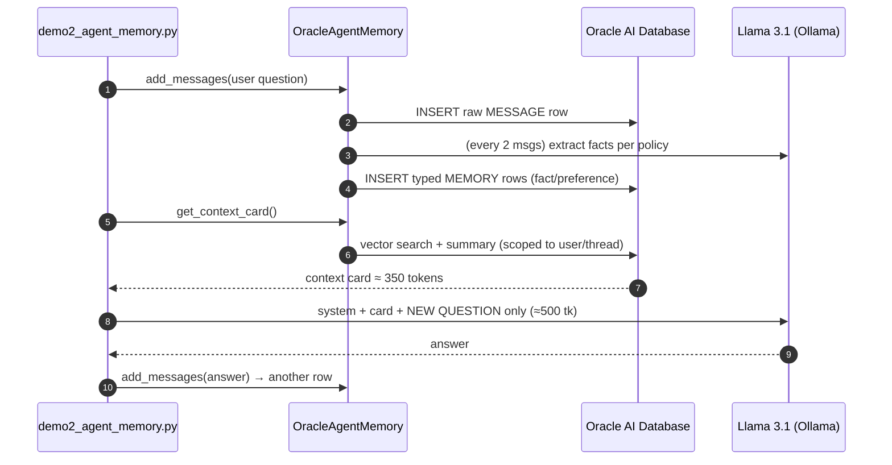

# `demo2_agent_memory.py` — the complete breakdown

This is a guided tour of [the demo-2 source](../agent-memory-use-case/live-demo/demo2_agent_memory.py),
top to bottom — what every block does, and exactly **where the token savings
come from**. If you only remember one thing, remember the three jobs:

> **store** the chat → `add_messages()` · **distill** the facts → an extraction
> policy · **find** them → `get_context_card()`

## The big picture — one conversation turn

Every turn of the conversation flows like this:



Note what **never** happens: the full transcript is never sent to the model.
That is the entire trick. Compare with demo 1, where the transcript **is** the
prompt and grows from 64 → **1,433 tokens per request** by turn 12.

---

## 1 · The extraction policy — teaching the distiller what matters

```python
EXTRACTION_POLICY = """
Extract only durable facts about the USER and their travel companions:
dietary restrictions, allergies, seating and travel preferences, budget,
trip plans, and names of companions. Allergies and dietary restrictions are
the highest-priority facts — record them exactly as stated, word for word.
Keep each memory short and specific.
Attribute every fact to the correct person — the user vs. a named companion —
and never merge two people's traits into one statement.
Ignore generic travel advice given by the assistant, greetings, small talk,
and anything already extracted. Never invent facts that were not stated.
""".strip()
```

This is not code — it's a **policy written in plain English**, passed to the
extraction LLM on every run. It decides what becomes a durable memory:

| Rule in the policy | Why it's there |
|---|---|
| only durable facts (diets, allergies, preferences, budget, plans, names) | remembering *everything* makes retrieval noisy — selectivity IS the feature |
| allergies word-for-word, highest priority | safety-critical facts must survive verbatim |
| attribute facts to the correct person | early runs merged "user is vegetarian" + "Ankita's allergy" into wrong combined facts |
| ignore assistant small talk / advice | otherwise the model's own suggestions get remembered as "facts" |
| never invent facts | an 8B extractor will happily hallucinate without this line |

> [!TIP]
> This maps 1-to-1 to `memory_extraction_custom_instructions` in the config
> below — the same mechanism Oracle's *custom memory extraction* blog
> describes: **remember better, not more.**

## 2 · `build_memory()` — one object, three ingredients

```python
def build_memory() -> OracleAgentMemory:
    pool = oracledb.create_pool(user=ORACLE_USER, password=ORACLE_PASSWORD,
                                dsn=ORACLE_DSN, min=1, max=4)
    return OracleAgentMemory(
        connection=pool,                       # 1 · the database
        embedder=Embedder(model=EMBED_MODEL,   # 2 · search by meaning
                          api_base=OLLAMA_BASE,
                          embedding_dimension=EMBED_DIM),
        llm=Llm(model=CHAT_MODEL,              # 3 · the distiller
                api_base=OLLAMA_BASE,
                temperature=0.0, max_tokens=1024, seed=42),
        schema_policy=SchemaPolicy.CREATE_IF_NECESSARY,
        memory_extraction_config=MemoryExtractionConfig(
            extract_memories=True,
            enable_context_summary=True,
            memory_extraction_frequency=2,
            extraction_mode=MemoryExtractionMode.INLINE,
            memory_extraction_custom_instructions=EXTRACTION_POLICY,
        ),
    )
```

The whole memory layer is **one object** with three dependencies:

1. **`connection`** — a plain `oracledb` pool to Oracle AI Database (the free
   Docker container). This is where messages, memories, and vectors live.
2. **`embedder`** — `nomic-embed-text` via Ollama (768-dim). Every stored text
   gets a vector, which is what makes "find memories *about seating*" work
   even when the words don't match.
3. **`llm`** — the extraction model (same local Llama). `temperature=0.0` and
   a fixed `seed` keep extraction as deterministic as an LLM allows.

And the knobs that shape behavior:

| Knob | Value | What it does |
|---|---|---|
| `schema_policy=CREATE_IF_NECESSARY` | — | the package creates its own tables (MESSAGE, MEMORY, chunks+vectors) on first run. No migrations, no DDL files. |
| `extract_memories=True` | on | message inserts can trigger fact extraction |
| `enable_context_summary=True` | on | the layer maintains a rolling thread summary for the card |
| `memory_extraction_frequency=2` | every 2 messages | one user+assistant exchange per extraction batch — small batches keep a small extractor accurate (we saw 8B hallucinate on big batches) |
| `extraction_mode=INLINE` | synchronous | deterministic for a demo; production would use `BACKGROUND` |
| `..._custom_instructions` | the policy | section 1 plugs in here |

## 3 · A clean slate every run

```python
try:
    memory.delete_thread(THREAD_ID)
except Exception:
    pass
for r in memory.search("anything", user_id=USER_ID, max_results=100,
                       record_types=["memory", "fact", "preference", "guideline"]):
    try:
        memory.delete_memory(r.id)
    except Exception:
        pass
```

Deleting the thread removes **thread-scoped** data — but that's the point of
scope: memories attached to the *user* survive across threads. Great for real
apps, bad for a reproducible demo — so we also sweep the user's memories.
(That user-scoped survival is exactly what makes "new chat, still remembers
your window seat" possible in real products.)

## 4 · The thread — and the card budget

```python
thread = memory.create_thread(
    thread_id=THREAD_ID, user_id=USER_ID, agent_id=AGENT_ID,
    context_card_token_limit=350)            # keep the card lean
```

Three identifiers — `thread_id`, `user_id`, `agent_id` — become columns on
every row this thread writes. They are the **scope** system: retrieval can be
narrowed to this thread, widened to this user across threads, or to this agent
across users.

`context_card_token_limit=350` is the **first half of the token optimization**:
whatever the memory layer knows, the card it hands back must fit in ~350
tokens. The context can't creep.

## 5 · The turn loop — where the tokens are saved

```python
for turn, question in enumerate(SCRIPT, start=1):
    thread.add_messages([Message(role="user", content=question)])     # STORE

    card = thread.get_context_card(max_recent_messages=2,             # FIND
                                   max_relevant_results=6)
    context = card.formatted_content or ""

    messages = [
        {"role": "system", "content":
            SYSTEM_PROMPT + "\n\n--- MEMORY CONTEXT (from database) ---\n" + context},
        {"role": "user", "content": question},                        # ← that's ALL
    ]

    tokens = payload_tokens(messages)          # what THIS request costs

    answer = chat(messages)
    thread.add_messages([Message(role="assistant", content=answer)])  # STORE
```

Step by step:

1. **STORE** — `add_messages()` writes the question as a raw `MESSAGE` row.
   Since `memory_extraction_frequency=2`, each user+assistant exchange also
   triggers the distiller (**DISTILL** runs behind this call): the extraction
   LLM reads the recent messages, applies the policy, and writes typed rows —
   `fact` / `preference` — scoped to user + agent + thread.
2. **FIND** — `get_context_card()` builds the cheat-sheet: a vector search
   over stored memories relevant to *right now* (`max_relevant_results=6`),
   the rolling summary, and only the last **2** raw messages
   (`max_recent_messages=2`). This is the second half of the optimization —
   without that cap, recent raw messages would creep back into the prompt.
3. **The bounded prompt** — look at the `messages` list. It has exactly two
   entries: system prompt + card, and the new question. **The transcript is
   not there.** The model never sees it, no matter how long the chat gets.
4. `payload_tokens()` measures the request with the same `chars ÷ 4`
   convention as the Oracle technical report, so the demo's numbers are
   comparable to the paper's.
5. The answer is stored as a row too — future extractions and cards can use
   it, but it will never be replayed wholesale.

### Why the count stays flat — the math

| What's in the request | Demo 1 (flat history), turn 12 | Demo 2 (memory), turn 12 |
|---|---|---|
| system prompt | 38 tk | 38 tk |
| conversation so far | **23 messages, re-sent — 1,379 tk** | **0 — it's in the database** |
| context card (facts + summary + 2 recent msgs) | — | ≤ 350 tk |
| the new question | 16 tk | 16 tk |
| **total** | **1,433 tk** | **≈ 500 tk** |

Flat history grows **linearly per turn** (so the whole conversation costs
quadratically). The memory request is **bounded by construction**: card ≤ 350
plus a question — it simply cannot grow. Turn 1 ≈ 240, turn 12 ≈ 500, turn
1,000 would still be ≈ 500. The longer the conversation, the bigger the win.

## 6 · After the loop — proof it's a database

```python
memory.wait_for_memory_extraction()          # flush any pending extraction

results = memory.search("user preferences, dietary restrictions, travel facts",
                        user_id=USER_ID, max_results=12,
                        record_types=["memory", "fact", "preference"])
```

`search()` is the same scoped vector search the card uses — here it prints the
distilled rows: *"User prefers window seats"*, *"Ankita is allergic to
peanuts"*. Run [`show_memories.py`](../agent-memory-use-case/live-demo/show_memories.py)
and you'll see the same thing in plain SQL — because that's all agent memory
is: **typed, scoped, SELECT-able rows.** The "Memory updated" toast you see in
chat apps is a database write.

> [!NOTE]
> **Honest limitation:** the distiller is only as good as the LLM doing the
> distilling. An 8B model on a laptop occasionally fumbles a fact. The memory
> *lifecycle* is a database problem — memory *quality* is still an LLM
> problem. One env var (`CHAT_MODEL=ollama/<bigger-model>`) upgrades it.

## Try it, then break it

```bash
./.venv/bin/python demo2_agent_memory.py
```

Knobs worth playing with:

- `context_card_token_limit` — shrink to 150: cheaper, but recall gets worse.
  Raise to 1000: better recall, watch the token bar climb. **This is the
  cost/quality dial.**
- `memory_extraction_frequency` — raise it and watch a small extractor start
  hallucinating on the bigger batches (we did; that's why it's 2).
- Delete the `EXTRACTION_POLICY` line and compare what gets remembered —
  baseline extraction vs. policy-shaped extraction.
- Ask a 13th question in a **new thread** with the same `user_id` — the
  window-seat preference follows the *user*, not the thread.
