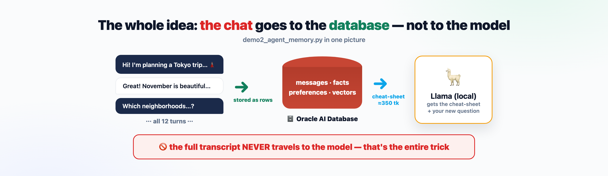
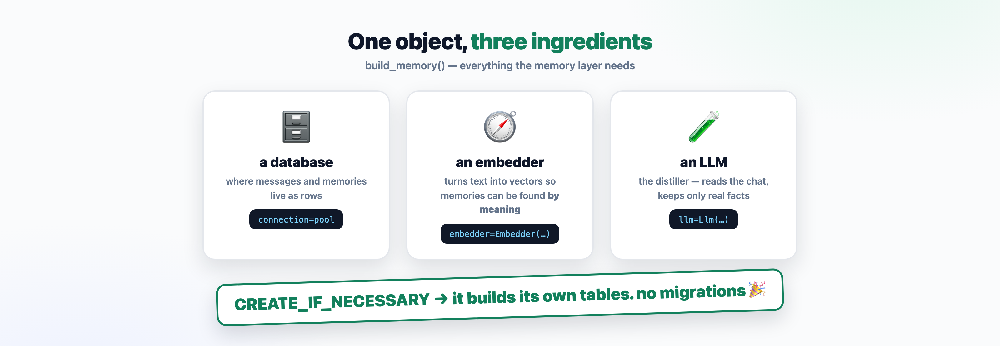
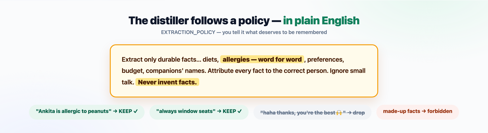
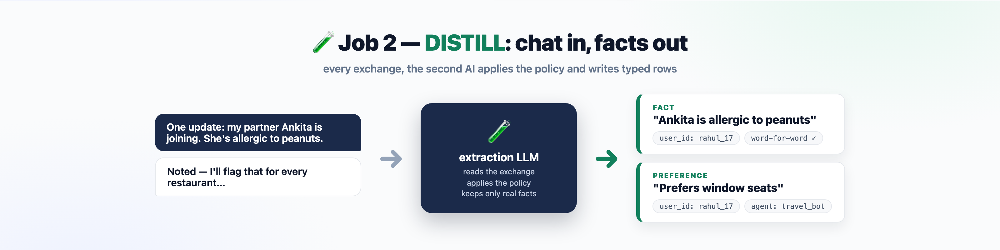
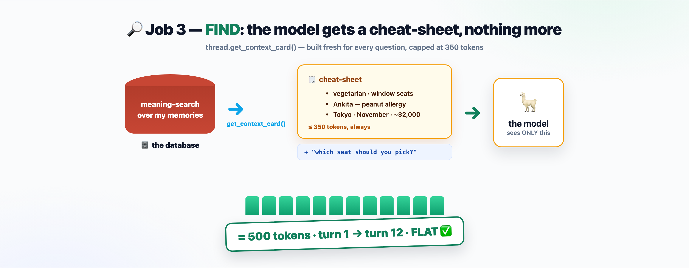
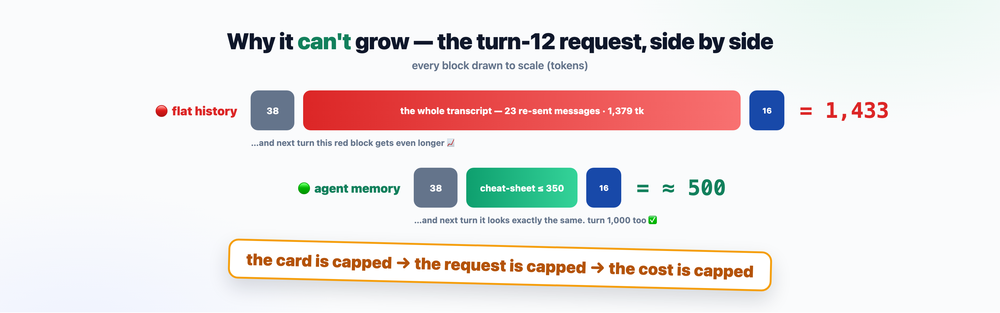

# `demo2_agent_memory.py` — the visual walkthrough

The whole file, explained in **7 pictures**. No jargon required.
(Prefer the deep, line-by-line version? →
[demo2-agent-memory-breakdown.md](demo2-agent-memory-breakdown.md))

---

## 1 · The whole idea

The chat goes to the **database**. The model only ever gets a small
cheat-sheet plus your newest question.



## 2 · One object, three ingredients

`build_memory()` wires up the memory layer — a database, an embedder, and an
LLM. That's the entire setup.



## 3 · The distiller follows a plain-English policy

You don't program what to remember — you *describe* it.



## 4 · Job 1 — STORE

Every message becomes a labeled row. Nothing is lost — and nothing is re-sent.


## 5 · Job 2 — DISTILL

A second AI reads each exchange and keeps only the real facts — typed and
labeled with whose they are.



## 6 · Job 3 — FIND

Before every answer, the database builds a fresh cheat-sheet — capped at 350
tokens — and that plus the question is ALL the model sees.



## 7 · Why the token count can't grow

Flat history drags the whole transcript along — and it gets longer every turn.
The memory request is capped by construction.



---

**That's the file.** Run it yourself:

```bash
cd agent-memory-use-case/live-demo
./.venv/bin/python demo2_agent_memory.py
```
